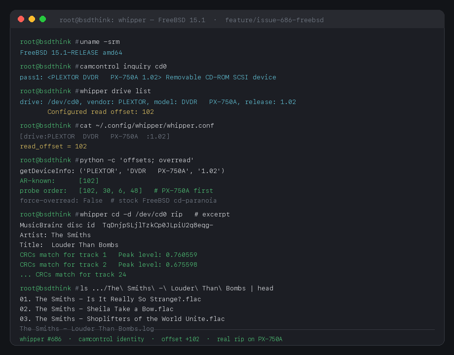

# Whipper

[](LICENSE)
[](https://github.com/ajzrva-sys/whipper/releases/latest)
[](https://github.com/whipper-team/whipper)
[](https://web.libera.chat/?channels=%23whipper)

Fork of [whipper-team/whipper](https://github.com/whipper-team/whipper). Python 3 CD-DA ripper. Accuracy over speed.

The published **[v0.11.0 release](https://github.com/ajzrva-sys/whipper/releases/tag/v0.11.0)**
contains this fork's FreeBSD support and ripping fixes. The `develop` branch
also includes unreleased offset-detection corrections; the upcoming
[`release/v0.12.0` branch](https://github.com/ajzrva-sys/whipper/tree/release/v0.12.0)
adds diagnostics and requires Python 3.11 or later.

The upstream proposals are split into [FreeBSD drive/tool support (#712)](https://github.com/whipper-team/whipper/pull/712)
and [offset detection and reproducible drive lookup (#713)](https://github.com/whipper-team/whipper/pull/713).
This fork retains its additional features, including optional drive-information
bindings and FreeBSD identity lookup via `camcontrol`.

The screenshot below is from earlier testing on FreeBSD 15.1 with a Plextor
PX-750A. On 22 September 2026, the revised offset search also confirmed +102
against all 12 required tracks of a 13-track disc on that drive, using the
FreeBSD identity fallback. Automated checks run on Linux and FreeBSD; this
single-drive result does not validate every entry in the published lookup table.



Whipper started as a fork of [morituri](https://github.com/thomasvs/morituri). Test & Copy rips, AccurateRip, MusicBrainz, FLAC. Details: [The Art of the Rip](https://web.archive.org/web/20160528213242/https://thomas.apestaart.org/thomas/trac/wiki/DAD/Rip).

## Table of content

- [Features](#features)
- [Changelog](#changelog)
- [Installation](#installation)
  * [Published release (v0.11.0)](#published-release-v0110)
  * [Development versions](#development-versions)
  * [Upstream (whipper-team/whipper)](#upstream-whipper-teamwhipper)
  * [Docker](#docker)
  * [Package](#package)
- [Building](#building)
  1. [Required dependencies](#required-dependencies)
  2. [FreeBSD](#freebsd)
  3. [Optional dependencies](#optional-dependencies)
  4. [Fetching the source code](#fetching-the-source-code)
  5. [Finalizing the build](#finalizing-the-build)
- [Usage](#usage)
- [Getting started](#getting-started)
- [Configuration file documentation](#configuration-file-documentation)
- [Running uninstalled](#running-uninstalled)
- [Logger plugins](#logger-plugins)
  * [Official logger plugins](#official-logger-plugins)
- [License](#license)
- [Contributing](#contributing)
  - [Developer Certificate of Origin (DCO)](#developer-certificate-of-origin-dco)
    - [DCO Sign-Off Methods](#dco-sign-off-methods)
  - [Bug reports & feature requests](#bug-reports--feature-requests)
- [Credits](#credits)
- [Links](#links)

## Features

- Detects correct read offset (in samples)
- Detects whether ripped media is a CD-R
- Has ability to defeat cache of drives
- Performs Test & Copy rips
- Verifies rip accuracy using the [AccurateRip database](http://www.accuraterip.com/)
- Uses [MusicBrainz](https://musicbrainz.org/doc/About) for metadata lookup
- Supports reading the [pre-emphasis](http://wiki.hydrogenaud.io/index.php?title=Pre-emphasis) flag embedded into some CDs (and correctly tags the resulting rip)
  - TOC pre-emphasis is used for cue-sheet `FLAGS PRE` (cdrdao behaviour)
  - When the drive exposes Q-subchannel control nibbles, whipper also reports **subcode** pre-emphasis in the rip log (`Pre-emphasis (subcode)`) and flags TOC/subcode conflicts (issue #296)
  - Subcode support is drive-dependent; if the drive does not report it, only the TOC value appears
- Detects and rips _non digitally silent_ [Hidden Track One Audio](http://wiki.hydrogenaud.io/index.php?title=HTOA) (HTOA)
- Provides batch ripping capabilities
- Provides templates for file and directory naming
- Supports lossless encoding of ripped audio tracks (FLAC)
- Allows extensibility through external logger plugins

## Changelog

See [CHANGELOG.md](CHANGELOG.md).

## Installation

### Published release (v0.11.0)

```bash
# Linux
pip install 'whipper[driveinfo,cover_art] @ https://github.com/ajzrva-sys/whipper/archive/refs/tags/v0.11.0.tar.gz'

# FreeBSD — pkg first (pip will not install cdrdao/cd-paranoia/flac/…)
pkg install -y python3 cdrdao flac sox libdiscid \
    libcdio-paranoia libsndfile eject pkgconf
pkg install -y py$(python3 -c 'import sys; print("%d%d" % sys.version_info[:2])')-pip
CFLAGS="-I/usr/local/include" LDFLAGS="-L/usr/local/lib" \
  python3 -m pip install 'https://github.com/ajzrva-sys/whipper/archive/refs/tags/v0.11.0.tar.gz'
```

From a clone:

```bash
git clone -b v0.11.0 https://github.com/ajzrva-sys/whipper.git
cd whipper
# FreeBSD system packages: su -m root -c 'sh scripts/freebsd-deps.sh'
pip install '.[driveinfo,cover_art]'   # Linux
# CFLAGS="-I/usr/local/include" LDFLAGS="-L/usr/local/lib" pip install .
```

```bash
whipper --version
whipper drive list
```

`gobject` (`PyGObject`) is an extra if you want it. The CLI rip path does not use it.

### Development versions

To use the corrected offset search and lookup table, install `develop` after
installing the [system dependencies](#required-dependencies):

```bash
git clone -b develop https://github.com/ajzrva-sys/whipper.git
cd whipper
python3 -m pip install '.[driveinfo,cover_art]'  # Linux
# FreeBSD (after installing the packages listed below):
# CFLAGS="-I/usr/local/include" LDFLAGS="-L/usr/local/lib" python3 -m pip install .
whipper --version
whipper drive list
```

For the upcoming v0.12 work, use `git clone -b release/v0.12.0` in place of
`git clone -b develop` above, with Python 3.11 or later. Only that branch adds
`whipper doctor` and the `-v` / `-vv` / `-vvv` verbosity levels. Use
`--version` to print the version on either branch.

The development branches are unreleased. The offset behavior described below
applies to these branches; installing the v0.11.0 tag does not include the new
confirmation and lookup corrections.

### Upstream (whipper-team/whipper)

Whipper still isn't available as an official package in every Linux distribution so, in order to use it, it may be necessary to [build it from its source code](#building).

### Docker

You can easily install whipper without needing to care about the required dependencies by making use of the automatically built images hosted on [Docker Hub](https://hub.docker.com/r/whipperteam/whipper):

`docker pull whipperteam/whipper`

Please note that, right now, Docker Hub only builds whipper images for the `amd64` architecture: if you intend to use them on a different one, you'll need to build the images locally (as explained below).

Building the Docker image locally is required in order to make it work on Arch Linux (and its derivatives) because of a group permission issue (for more details see [issue #499](https://github.com/whipper-team/whipper/issues/499)).

To build the Docker image locally just issue the following command (it relies on the [Dockerfile](https://github.com/whipper-team/whipper/blob/develop/Dockerfile) included in whipper's repository):

`optical_gid=$(getent group optical | cut -d: -f3) uid=$(id -u) docker build --build-arg optical_gid --build-arg uid -t whipperteam/whipper .`

It's recommended to create an alias for a convenient usage:

```bash
alias whipper="docker run -ti --rm --device=/dev/cdrom \
    --mount type=bind,source=${HOME}/.config/whipper,target=/home/worker/.config/whipper \
    --mount type=bind,source=${PWD}/output,target=/output \
    whipperteam/whipper"
```

You should put this e.g. into your `.bash_aliases`. Also keep in mind to replace the path definitions to something that fits to your needs (e.g. replace `… -v ${PWD}/output:/output …` with `… -v ${HOME}/ripped:/output \ …`).

Essentially, what this does is to map the /home/worker/.config/whipper and ${PWD}/output (or whatever other directory you specified) on your host system to locations inside the Docker container where the files can be written and read. These directories need to exist on your system before you can run the container:

`mkdir -p "${HOME}/.config/whipper" "${PWD}/output"`

Please note that the example alias written above only provides access to a single disc drive: if you've got many you will need to customise it in order to use all of them in whipper's Docker container.

Finally, you can test the correct installation as such:

```
whipper --version
whipper drive list
```

### Package

This is a noncomprehensive summary which shows whipper's packaging status (unofficial repositories are probably not included):

[](https://repology.org/metapackage/whipper)

**NOTE:** if installing whipper from an unofficial repository please keep in mind it is your responsibility to verify that the provided content is safe to use.

## Building

If you are building from a source tarball or checkout, you can choose to use whipper installed or uninstalled _but first install all the required dependencies_.

### Required dependencies

Whipper relies on the following packages in order to run correctly and provide all the supported features:

- [cd-paranoia](https://github.com/rocky/libcdio-paranoia), for the actual ripping
  - To avoid bugs it's advised to use `cd-paranoia` versions ≥ **10.2+0.94+2**
  - The package named `libcdio-utils`, available on older Debian and Ubuntu versions, is affected by a bug: it doesn't include the `cd-paranoia` binary (needed by whipper). Starting with Debian bullseye (11) and Ubuntu focal (20.04), a separate`cd-paranoia` package is available which provides the aforementioned binary. For more details on this issue, please check the relevant bug reports: [#888053 (Debian)](https://bugs.debian.org/cgi-bin/bugreport.cgi?bug=888053), [#889803 (Debian)](https://bugs.debian.org/cgi-bin/bugreport.cgi?bug=889803) and [#1750264 (Ubuntu)](https://bugs.launchpad.net/ubuntu/+source/libcdio/+bug/1750264).
- [cdrdao](http://cdrdao.sourceforge.net/), for session, TOC, pre-gap, and ISRC extraction
- [musicbrainzngs](https://pypi.org/project/musicbrainzngs/), for metadata lookup
- [mutagen](https://pypi.python.org/pypi/mutagen), for tagging support
- [setuptools](https://pypi.python.org/pypi/setuptools), for installation, plugins support
- [pycdio](https://pypi.python.org/pypi/pycdio/), for drive identification (`pip install '.[driveinfo]'`). Optional in this fork: without it, FreeBSD uses `camcontrol inquiry`, and Linux still rips if you pass `--offset` (or have it in the config).
  - To avoid bugs it's advised to use the most recent `pycdio` version with the corresponding `libcdio` release or, if stuck on old pycdio versions, **0.20**/**0.21** with `libcdio` ≥ **0.90** ≤ **0.94**. All other combinations won't probably work.
- [discid](https://pypi.org/project/discid/), for calculating Musicbrainz disc id.
- [ruamel.yaml](https://pypi.org/project/ruamel.yaml/), for generating well formed YAML report logfiles
- [libsndfile](http://www.mega-nerd.com/libsndfile/), for reading wav files
- [flac](https://xiph.org/flac/), for reading flac files
- [sox](http://sox.sourceforge.net/), for track peak detection
- [git](https://git-scm.com/) or [mercurial](https://www.mercurial-scm.org/)
  - Required either when running whipper without installing it or when building it from its source code (code cloned from a git/mercurial repository).

Some dependencies aren't available in the PyPI. They can be probably installed using your distribution's package manager:

- [cd-paranoia](https://github.com/rocky/libcdio-paranoia)
- [cdrdao](http://cdrdao.sourceforge.net/)
- [libsndfile](http://www.mega-nerd.com/libsndfile/)
- [flac](https://xiph.org/flac/)
- [sox](http://sox.sourceforge.net/)
- [git](https://git-scm.com/) or [mercurial](https://www.mercurial-scm.org/)
- [libdiscid](https://musicbrainz.org/doc/libdiscid)

PyPI installable dependencies are listed in the [requirements.txt](https://github.com/whipper-team/whipper/blob/develop/requirements.txt) file and can be installed issuing the following command:

`pip3 install -r requirements.txt`

### FreeBSD

Whipper can run on FreeBSD. Linux-only pieces are skipped automatically
(CDROM_DRIVE_STATUS ioctl, `/proc/mounts` unmount detection) — see
[#686](https://github.com/whipper-team/whipper/issues/686).

`pkg` has no `requirements.txt`. The list is [freebsd-packages.txt](freebsd-packages.txt).

```
# from a clone
su -m root -c 'sh scripts/freebsd-deps.sh'

# same thing by hand
pkg install -y $(grep -vE '^#|^$' freebsd-packages.txt)
pkg install -y py$(python3 -c 'import sys; print("%d%d" % sys.version_info[:2])')-pip
```

`py312-pip` vs `py311-pip` follows whatever `python3` is on that box. The script picks it. `pycdio` is optional and not always packaged.

Build and install whipper (PyGObject and pycdio are **not** required
for CLI rips):

```
export CFLAGS="-I/usr/local/include"
export LDFLAGS="-L/usr/local/lib"
# optional extras: pip install '.[driveinfo]'  # pycdio
#                 pip install '.[gobject]'    # PyGObject
python3 -m pip install .
```

Typical optical device nodes are `/dev/cd0` (CAM) or `/dev/acd0`.
On FreeBSD they are usually owned `root:operator` mode `640`. To rip
as a non-root user:

```
pw groupmod operator -m youruser
# or temporarily:
chmod 666 /dev/cd0   # not recommended long-term
```

Whipper shells out to `camcontrol`, `eject`, `cdrdao`, `cd-paranoia`,
`flac`, and `sox`. Ports install many of these under `/usr/local/bin`
and `/usr/local/sbin`. Put both on `PATH` for the user (and any
service wrapper) that runs whipper:

```
export PATH="/usr/local/bin:/usr/local/sbin:$PATH"
```

If `/usr/local/sbin` is missing, tray close (`eject -t` fallback) can
fail even when the FreeBSD `eject` package is installed.

Non-root checklist on FreeBSD:

```
pw groupmod operator -m youruser
# new login so group membership applies
su - youruser
export PATH="/opt/whipper/venv/bin:/usr/local/bin:/usr/local/sbin:$PATH"
whipper drive list
whipper cd -d /dev/cd0 info
```

Config for that user is written under `~/.config/whipper/whipper.conf`
(offsets, drive identity) — it is **per-user**; root’s config is not
shared. After `whipper offset find` as that user (or copy the drive
section).

Default FreeBSD node modes are not enough for non-root `camcontrol`:
`/dev/cd0` is often `root:operator` `640`, but `/dev/xpt0` and
`/dev/passN` are `600`. Group `operator` membership plus group RW on
those nodes lets `camcontrol inquiry`/`devlist` work so drive identity
is recorded without pycdio:

```
# runtime (lost on reboot)
chgrp operator /dev/xpt0 /dev/pass* /dev/cd0
chmod g+rw /dev/xpt0 /dev/pass* /dev/cd0
```

For persistence, add a `devfs` rule set for the `operator` group (see
`devfs(8)` / `devfs.rules`) rather than hand-chmod after every boot.

Multiple optical drives: when pycdio is missing, whipper enumerates
units from `camcontrol devlist` (`cd0`, `cd1`, `acd0`, …) instead of
only a short hardcoded list. `whipper drive list` shows every node;
pass `-d /dev/cdN` to target one.

Overread (`whipper cd rip -x`): stock FreeBSD `cd-paranoia` from
ports often **does not** implement `--force-overread` (that flag comes
from patched/whipper-oriented builds). whipper detects this, logs a
warning, and rips **without** overread instead of failing. Lead-out
samples beyond the last track may be missing; AccurateRip matching for
the final track can still work if that track does not need overread.

`pycdio` is optional: without it, whipper falls back to FreeBSD
`camcontrol inquiry` for vendor/model/release so `drive list` and rip
logs still name the drive. You should still pass `--offset` (or set it
in the config) when the offset is not stored for that identity.

Tray open/close prefers base-system `camcontrol load|eject <periph>`
(e.g. `cd0`) on BSDs and falls back to `eject` / `eject -t`. Install
the FreeBSD `eject` package if you want that fallback; a missing binary
is logged as a warning and does not abort the rip.

`cdrdao` is invoked with `--driver generic-mmc` on non-Linux platforms
so CAM/USB optical drives get a predictable SCSI transport.

`whipper offset find` uses the same offset search on Linux and FreeBSD.
In the development branches, configured and published offsets prioritize
probing, and every candidate must confirm all tracks except the last before
it is saved. See [Getting started](#getting-started) for the search switches
and [lookup-table regeneration](misc/accuraterip/README.md) for the captured
source, checksum, and explicit input/output arguments.

Optional pycdio (for parity with Linux offset-by-drive storage) can be
built from source once `pkg-config`, `swig`, and `libcdio` are present:

```
pkg install pkgconf swig libcdio
pip install pycdio
```

There is currently no FreeBSD quarterly package for pycdio.

### Optional dependencies
- [Pillow](https://pypi.org/project/Pillow/), for completely supporting the cover art feature (`embed` and `complete` option values won't work otherwise).
- [docutils](https://pypi.org/project/docutils/), to build the man pages.
- [pycdio](https://pypi.org/project/pycdio/) (`pip install '.[driveinfo]'`), for libcdio-based drive vendor/model. Optional on FreeBSD (camcontrol fallback).
- [PyGObject](https://pypi.org/project/PyGObject/) (`pip install '.[gobject]'`), not required for CLI rips.

These dependencies are not listed in the `requirements.txt`. To install them, just issue the following command:

`pip3 install Pillow docutils`

### Fetching the source code

Change to a directory where you want to put whipper source code (for example, `$HOME/dev/ext` or `$HOME/prefix/src`)

```bash
git clone https://github.com/ajzrva-sys/whipper.git
cd whipper
```

Vanilla upstream is still [whipper-team/whipper](https://github.com/whipper-team/whipper).

### Finalizing the build

Install whipper: `python3 setup.py install`

Note that, depending on the chosen installation path, this command may require elevated rights.

To build the man pages, follow the instructions in the relevant [README](https://github.com/whipper-team/whipper/blob/develop/man/README.md) which is located in the `man` subfolder.

## Usage

Whipper currently only has a command-line interface called `whipper` which is self-documenting: `whipper -h` gives you the basic instructions.

Whipper implements a tree of commands: for example, the top-level `whipper` command has a number of sub-commands.

Positioning of arguments is important:

`whipper cd -d (device) rip`

is correct, while

`whipper cd rip -d (device)`

is not, because the `-d` argument applies to the `cd` command.

A more complete set of usage instructions can be found in the `whipper` [man pages](https://github.com/whipper-team/whipper/blob/develop/man/README.md).

## Getting started

The simplest way to get started making accurate rips is:

1. Pick a relatively popular CD that has a good chance of being in the AccurateRip database
2. Analyze the drive's caching behavior

   `whipper drive analyze`

3. Find the drive's offset.

   Consult the [AccurateRip's CD Drive Offset database](http://www.accuraterip.com/driveoffsets.htm) for your drive. Drive information can be retrieved with `whipper drive list`.

   `whipper offset find -o insert-numeric-value-here`

   If you omit the `-o` argument, whipper will try a long, popularity-sorted list of drive offsets.

   Offset finding first tries a short AccurateRip checksum window and uses
   configured and published drive-model offsets to prioritize ordinary probing.
   Every candidate must match all tracks except the last before it is saved.
   These checks confirm an offset against the inserted disc; the model lookup
   alone does not verify a drive. Missing window data falls back to ordinary
   probing. If no offset matches, try another disc in the AccurateRip database.

   Supplying `--offsets` probes only the listed values, in order, bypassing
   automatic selection. `--no-frame450 --no-prioritize-known` uses the original
   candidate order and full-track probing. The bundled lookup table is
   [reproducible from its source snapshot](misc/accuraterip/README.md).

   If you can not confirm your drive offset value but wish to set a default regardless, set `read_offset = insert-numeric-value-here` in `whipper.conf`.

   Offsets confirmed with `whipper offset find` are automatically written to the configuration file.

   If specifying the offset manually, please note that: if positive it must be written as a number without sign (ex: `+102` -> `102`), if negative it must include the sign too (ex: `-102` -> `-102`).

4. Rip the disc by running

   `whipper cd rip`

## Configuration file documentation

The configuration file is stored in `$XDG_CONFIG_HOME/whipper/whipper.conf`, or `$HOME/.config/whipper/whipper.conf` if `$XDG_CONFIG_HOME` is undefined.

See [XDG Base Directory
Specification](http://standards.freedesktop.org/basedir-spec/basedir-spec-latest.html)
and [ConfigParser](https://docs.python.org/3/library/configparser.html) with `inline_comment_prefixes=(';')`.

The configuration file consists of newline-delineated `[sections]`
containing `key = value` pairs. The sections `[main]` and
`[musicbrainz]` are special config sections for options not accessible
from the command line interface.  Sections beginning with `drive` are
written by whipper; certain values should not be edited. Inline comments can be added using `;`.

Example configuration demonstrating all `[main]` and `[musicbrainz]`
options:

```INI
[main]
path_filter_dot = True			; replace leading dot with _
path_filter_posix = True		; replace illegal chars in *nix OSes (and ") with _
path_filter_vfat = False		; replace illegal chars in VFAT filesystems with _
path_filter_whitespace = False		; replace all whitespace chars with _
path_filter_printable = False		; replace all non printable ASCII chars with _

[musicbrainz]
server = https://musicbrainz.org	; use MusicBrainz server at host[:port]
# use http as scheme if connecting to a plain http server. Example below:
# server = http://example.com:8080

[drive:HL-20]
defeats_cache = True			; whether the drive is capable of defeating the audio cache
read_offset = 6				; drive read offset in positive/negative frames (no leading +)
# do not edit the values 'vendor', 'model', and 'release'; they are used by whipper to match the drive

# top-level whipper arguments go in [whipper]; subcommand arguments go in [whipper.subcommand...]
[whipper]
eject = always

# command line defaults for `whipper cd rip`
[whipper.cd.rip]
unknown = True
output_directory = ~/My Music
# Note: the format char '%' must be represented '%%'.
# Do not add inline comments with an unescaped '%' character (else an 'InterpolationSyntaxError' will occur).
track_template = new/%%A/%%y - %%d/%%t - %%n
disc_template =  new/%%A/%%y - %%d/%%A - %%d
# ...
```

## Running uninstalled

To make it easier for developers, you can run whipper straight from the
source checkout:

```bash
python3 -m whipper -h
```

## Logger plugins

Whipper allows using external logger plugins to customize the template of `.log` files.

The available plugins can be listed with `whipper cd rip -h`. Specify a logger to rip with by passing `-L loggername`:

```bash
whipper cd rip -L eac
```

Whipper searches for logger plugins using `importlib.metadata.entry_points`, meaning any package visible to the Python
interpreter exporting a `whipper.logger` entry point will be loaded.

Please note that locally installed logger plugins won't be recognized when whipper has been installed through the official Docker image.

### Official logger plugins

I suggest using whipper's default logger unless you've got particular requirements.

- [whipper-plugin-eaclogger](https://github.com/whipper-team/whipper-plugin-eaclogger) - a plugin for whipper which provides EAC style log reports

## License

Licensed under the [GNU GPLv3 license](http://www.gnu.org/licenses/gpl-3.0).

```Text
Copyright (C) 2009 Thomas Vander Stichele
Copyright (C) 2016-2021 The Whipper Team: JoeLametta, Samantha Baldwin,
                        Merlijn Wajer, Frederik “Freso” S. Olesen, et al.

This program is free software; you can redistribute it and/or modify
it under the terms of the GNU General Public License as published by
the Free Software Foundation; either version 3 of the License, or
(at your option) any later version.

This program is distributed in the hope that it will be useful,
but WITHOUT ANY WARRANTY; without even the implied warranty of
MERCHANTABILITY or FITNESS FOR A PARTICULAR PURPOSE.  See the
GNU General Public License for more details.

You should have received a copy of the GNU General Public License
along with this program; if not, write to the Free Software Foundation,
Inc., 51 Franklin Street, Fifth Floor, Boston, MA 02110-1301  USA
```

## Contributing

This fork lives at [ajzrva-sys/whipper](https://github.com/ajzrva-sys/whipper). Changes meant for upstream should go to [whipper-team/whipper](https://github.com/whipper-team/whipper).

Where possible, include tests for new or changed functionality. You can run tests with `python3 -m unittest discover` from your source checkout.

### Developer Certificate of Origin (DCO)

To make a good faith effort to ensure licensing criteria are met, this project requires the Developer Certificate of Origin (DCO) process to be followed.

The Developer Certificate of Origin (DCO) is a document that certifies you own and/or have the right to contribute the work and license it appropriately. The DCO is used instead of a _much more annoying_
[CLA (Contributor License Agreement)](https://en.wikipedia.org/wiki/Contributor_License_Agreement). With the DCO, you retain copyright of your own work :). The DCO originated in the Linux community, and is used by other projects like Git and Docker.

The DCO agreement is shown below, and it's also available online: [HERE](https://developercertificate.org/).

```
Developer Certificate of Origin
Version 1.1

Copyright (C) 2004, 2006 The Linux Foundation and its contributors.
1 Letterman Drive
Suite D4700
San Francisco, CA, 94129

Everyone is permitted to copy and distribute verbatim copies of this
license document, but changing it is not allowed.


Developer's Certificate of Origin 1.1

By making a contribution to this project, I certify that:

(a) The contribution was created in whole or in part by me and I
    have the right to submit it under the open source license
    indicated in the file; or

(b) The contribution is based upon previous work that, to the best
    of my knowledge, is covered under an appropriate open source
    license and I have the right under that license to submit that
    work with modifications, whether created in whole or in part
    by me, under the same open source license (unless I am
    permitted to submit under a different license), as indicated
    in the file; or

(c) The contribution was provided directly to me by some other
    person who certified (a), (b) or (c) and I have not modified
    it.

(d) I understand and agree that this project and the contribution
    are public and that a record of the contribution (including all
    personal information I submit with it, including my sign-off) is
    maintained indefinitely and may be redistributed consistent with
    this project or the open source license(s) involved.
```

#### DCO Sign-Off Methods

The DCO requires a sign-off message in the following format appear on each commit in the pull request:

```
Signed-off-by: Full Name <email>
```

The DCO text can either be manually added to your commit body, or you can add either `-s` or `--signoff` to your usual Git commit commands. If you forget to add the sign-off you can also amend a previous commit with the sign-off by running `git commit --amend -s`.

### Bug reports & feature requests

Fork-specific problems (FreeBSD, the bundled PRs): [open an issue here](https://github.com/ajzrva-sys/whipper/issues).

Something that is also broken upstream: [whipper-team/whipper](https://github.com/whipper-team/whipper/issues).

When filing bug reports, please run the failing command with the environment variable `WHIPPER_DEBUG` set. For example:

```bash
WHIPPER_DEBUG=DEBUG WHIPPER_LOGFILE=whipper.log whipper offset find
gzip whipper.log
```

Finally, attach the gzipped log file to your bug report.

Without `WHIPPER_LOGFILE` set, logging messages will go to stderr. `WHIPPER_DEBUG` accepts a string of the [default python logging levels](https://docs.python.org/3/library/logging.html#logging-levels).

_If you can, please try to help to solve [THIS issue](https://github.com/rocky/libcdio-paranoia/issues/14) which also has an [open bounty](https://www.bountysource.com/issues/60536098-incorrectly-fetches-track-length-with-certain-offsets) on Bountysource._

## Credits

Thanks to:

- [Thomas Vander Stichele](https://github.com/thomasvs)
- [Joe Lametta](https://github.com/JoeLametta)
- [Samantha Baldwin](https://github.com/RecursiveForest)
- [Frederik “Freso” S. Olesen](https://github.com/Freso)
- [Merlijn Wajer](https://github.com/MerlijnWajer)

And to all the [contributors](https://github.com/whipper-team/whipper/graphs/contributors).

## Links

You can find us and talk about the project on:

- IRC: **`#whipper`** channel on the [Libera.Chat](ircs://irc.libera.chat:6697) network
  - See [Libera.Chat’s guide on how to connect](https://libera.chat/guides/connect)
    - Or just use the [Kiwi IRC web client](https://kiwiirc.com/nextclient/irc.libera.chat/?#whipper)
- Matrix (the room is a portal to Libera Chat's IRC channel)
  - Join to the room named **`#whipper`** (**`libera.chat`** is the homeserver)
  - Use Matrix's invite link for [#whipper:libera.chat](https://matrix.to/#/#whipper:libera.chat)
  - Access Matrix through the [Element web client](https://app.element.io/#/room/#whipper:libera.chat)
- [Redacted thread (official)](https://redacted.ch/forums.php?action=viewthread&threadid=150)

Other relevant links:
- [Whipper - Hydrogenaudio Knowledgebase](https://wiki.hydrogenaud.io/index.php?title=Whipper)
- [Repology: versions for whipper](https://repology.org/metapackage/whipper/versions)
- [Unattended ripping using whipper (by Thomas McWork)](https://github.com/thomas-mc-work/most-possible-unattended-rip)
